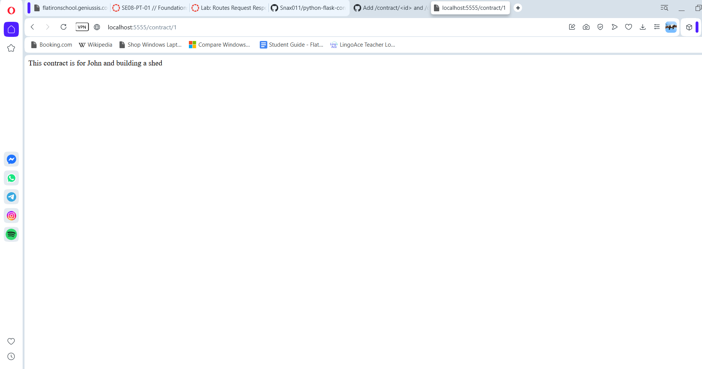

# Flatiron Contracts - Flask Request/Response Lab

## Description

A small Flask application that manages contract and customer lookups for a
company that brokers contracts between two parties. It demonstrates using
different HTTP response codes to communicate results:

- `GET /contract/<id>` — looks up a contract by numeric id.
  - Returns the contract information with a **200** status if found.
  - Returns an empty body with a **404** status if not found.
- `GET /customer/<customer_name>` — confirms whether a customer exists,
  without exposing any customer data.
  - Returns an empty body with a **204** status if the customer exists.
  - Returns an empty body with a **404** status if not found.

## Screenshot



## Getting Started

### Prerequisites

- Python 3.12
- [pipenv](https://pipenv.pypa.io/en/latest/)

### Installation

```bash
git clone git@github.com:<your-username>/python-flask-contracts-lab.git
cd python-flask-contracts-lab
pipenv install
pipenv shell
```

### Running the app

```bash
python server/app.py
```

The server starts on `http://localhost:5555`.

- Visit `/contract/<id>` (e.g. `/contract/1`) to look up a contract.
- Visit `/customer/<customer_name>` (e.g. `/customer/bob`) to confirm a customer exists.

### Running tests

```bash
pipenv run pytest
```

## Project Structure

```
server/
  app.py          # Flask app and routes
  testing/        # Test suite for the routes
```

## License

See LICENSE.md.
